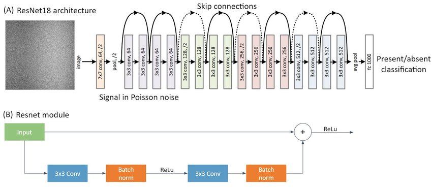
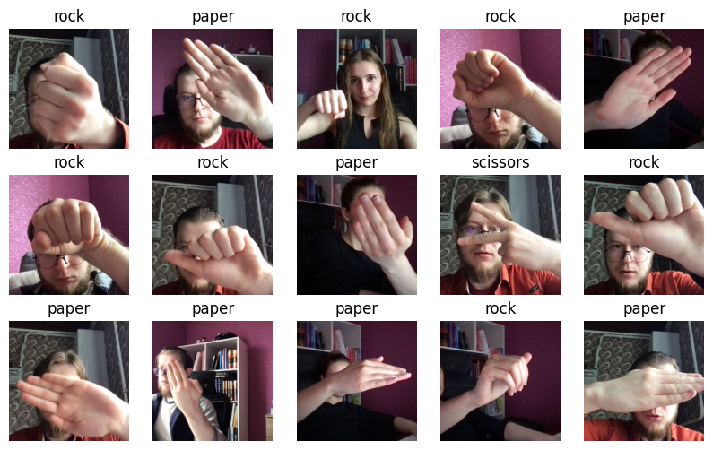
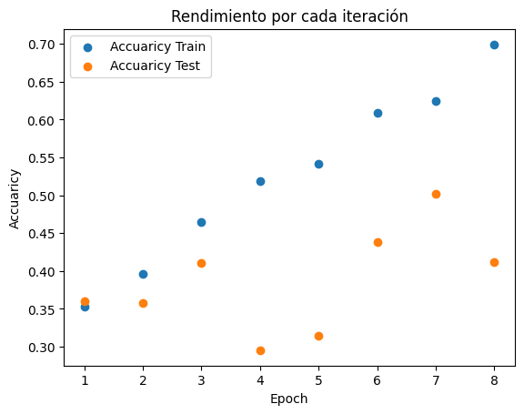
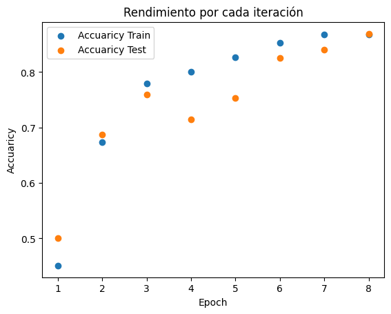
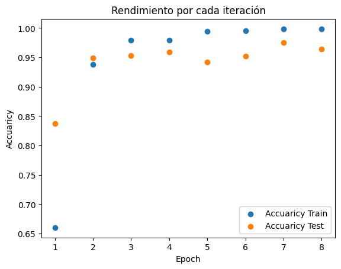

<h1 align='center'> Proyectos: Detección de imagenes de piedra papel o tijeras con redes neuronales convolucionales</h1>


<h2 align='center'>Bruno Zenobio</h2>

---

## **`Tabla de Contenidos`**

- [Introducción](#introducción)
- [Desarrollo](#desarrollo)
    - [Extracción de los datos](#extracción-de-los-datos)
    - [Preparación](#preparación-de-los-datos)
    - [Modelos](#modelosn)
    - [Testeo](#testeo)
    - [Conclusión](#conclusión)
- [Contacto](#contacto)

- ## **`Links`**
    - [Dataset](https://www.kaggle.com/datasets/glushko/rock-paper-scissors-dataset)
    - [Modelo](./model/)


---

# Introducción

En este proyecto, me sumergire en el mundo de las redes neuronales, para realizar un modelo de predicción de imagenes sobre el juego piedra papel o tijera, para esto evaluaremos distintos modelos alterados de la arquitectura ResNet:

Las redes ResNet usan una arquitectura de red neuronal residual, de esta forma se aprende a mapear la entrada a la diferencia entre la entrada y la salida deseada. Utilizando capas convolucionales y de Pooling en esa arquitectura se puede obtener un resultado bastante aceptable sin contar con una gran cantidad de datos, a partir de la tecnica de transfer learning.

La arquitectura usada fue ResNet18, una version de las arquitecturas ResNet, particularmente esta tiene 18 capas, el modelo fue entrenado con conjuntos de datos de ImageNet, la cual guarda conjuntos de millones de imagenes, el modelo ademas tiene 1000 categorias de salida, por esto habra que adaptarlo a la situación modificando sus capas. 

 **`Dentro de una arquitectura convolucional tenemos:`**

- Capas Convolucionales: Se encargan de aplicar un filtro a una imagen, de manera local en un rango determinado.
- Capas de Pooling: Se encargan de reducir la dimension para aumentar el rendimiento y captar caracteristicas robustas.

<br>

<p ></p>

Ahora bien, entrando de lleno en el modelo, este tiene por objeto probar diferentes estrategias, dentro de la arquitectura ResNet, a partir de un dataset que no posee una gran cantidad de imagenes, este mismo fue extraido de Kaggle [dataset](https://www.kaggle.com/datasets/glushko/rock-paper-scissors-dataset) y guarda imagenes, de manos realizando los gestos de piedra,papel y tijeras.


<p ></p>

---

# Desarrollo

### Extracción de los datos

Como antes se habia mensionado, se extrayeron de la plataforma de Kaggle, obteniendose un total de 1560 imagnes, los cuales fueron disponibilizados para el entrenamiento (1248) y testeo (312).


### Preparación de los datos

Como se usara la la libreria de PyTorch, esta necesita a los datos en cierto formato, ademas hay que tener cuidado con el orden de la dimension de una imagen, ya que suelen venir en (alto x ancho x canal) y se necesita (canal x alto x ancho), es por esto que se define una clase Dataset, la cual extiende de PyTorch y nos permitira generar el conjunto de datos adecuados, en este se aplican transformaciónes necesarias en la imagen para que quede formato adecuado. 

Ademas con el proposito de realizar un entrenamiento mas optimo se debe separar las imagenes en batches, esto se hara con dataloader. Finalmente nuestro conjunto de datos quedara de la forma (batch_size x canal x ancho x alto).


### Modelos

Para poder probar, distintas estructuras, a partir de la arquitectura de ResNet, modificada para que las clases de salida sean un total de 3, se probaran distintas estrategias con una cantidad de 8 iteraciones.

- **`Arquitecura de ResNet sin sus pesos`**: Solo se uso la arquitectura de la red, y se entrenaron las imagenes, ademas se usaran 8 iteraciones, se puede observar que el accuaricy en el conjunto de entrenamiento aumenta de forma lineal, hasta llegar a un poco mas de 0.7, mientras que en el conjunto de testeo, se observa inestabilidad, y bajo rendimiento. De esto se ve que el modelo en general a tenido overfiting y un bajo rendimiento,ademas que la funcion de perdida no fue minimizada eficientemente.
<p ></p>

- **`Arquitecura de ResNet con sus pesos fijos(pretrainet = True,freeze=True)`**: En este caso,usando los pesos ya existentes, y no actualizandolos, se puede observar un claro aumento en el rendimiento, la funcion de perdida disminuyo bastante, y en el epoch numero 8 se observa una casi igualdad entre el accuaricy del conjunto de entrenamiento y testeo en 0.86.

<p ></p>


- **`Arquitecura de ResNet con sus pesos alterables(pretrainet = True,freeze=False)`**: Para este caso se observan resultados aun mejores para el epoch numero 4, ya se obtiene en la funcion de perdida, 0.1 y un accuaricy de 0.97 y 0.95 en el conjunto de entrenamiento y testeo respectivamente, lo cual nos indica que el modelo a convergido de manera eficiente.
<p ></p>

<br>

Debido a los resultados obtenidos la arquitectura de ResNet con sus pesos, y permitiendo que se reentrene sera el utilizado para el modelo final.

### Modelo Final

Con la informacón de los distintos entrenamientos, se decidio entrenar al modelo final, con la arquitectura de resnet, con los pesos existentes y la posibilidad de reentrenarse, ademas se usaron 4 epochs y un ratio de perdida de 0.01, finalmente este se guardado en [modelo](./model/).

### Testeo


### Conclusión

Como conslusión, se puede ver que si bien el modelo sufre algunas equivocaciones, a logrado predecir bastante bien, teniendo en cuenta ademas, que el dataset tenia menos de 2000 datos para el entrenamiento, aun asi el resultado de este trabajo se cierra aqui, sin embargo el modelo esta guardado con sus pesos, para poder reentrenarse en un futuro.

Para complemtar el modelo, es un buena practicar reentrenar el modelo modificando capas, usando diferentes lr y cantidad de epochs.

### Como usar:

- **`Clonar en una maquina con python funcional`**
```bash
$ git clone https://github.com/brunozenobio/Convolutional_PRS/tree/main
```
- **`Instalar el requeriments.txt`**
```bash
$ pip install -r requirements.txt
```
- **`Agrega la imagen a la carpeta data_test`**
- **`En una terminal ejecutar predict.py`**

Desde la raiz:
```python
$ python.exe .\code\src\predict.py image
```


## Contacto

<div style="display: flex; align-items: center;">
  <a href="https://www.linkedin.com/in/brunozenobio/" style="margin-right: 10px;">
    
  </a>
  <a href="mailto:brunozenobio4@gmail.com" style="margin-right: 10px;">
    
  </a>
</div>
